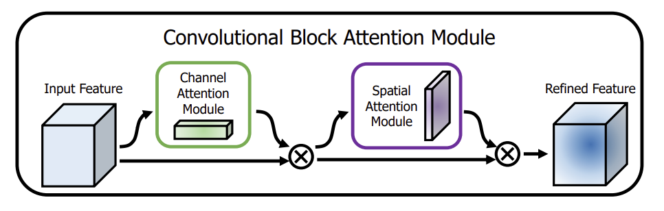
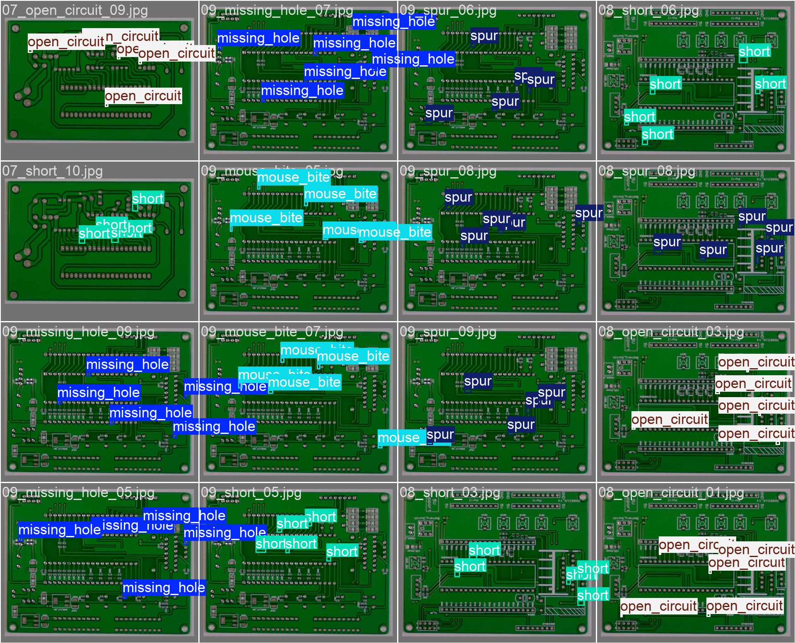
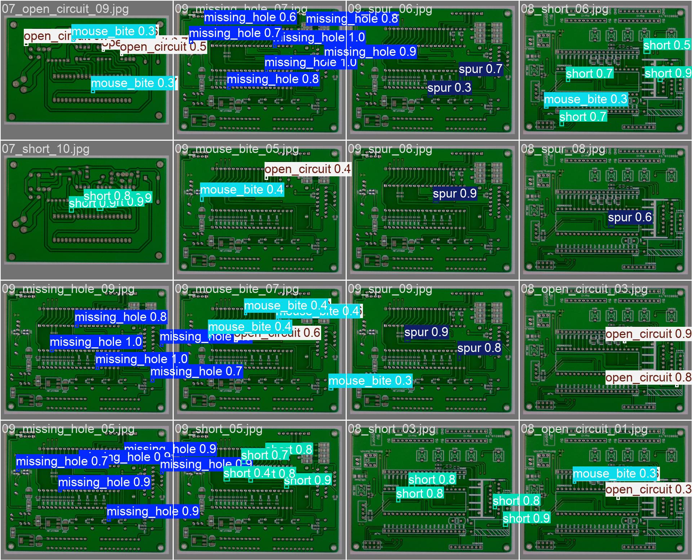
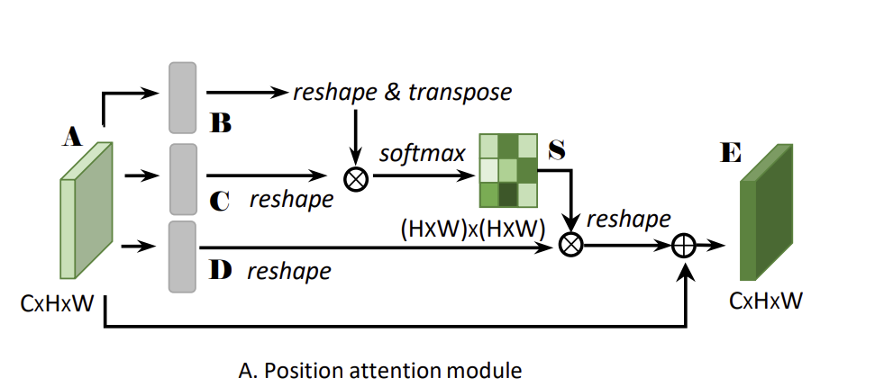

# 第一题说明文档

## 第一小题
  对于题目1，我通过阅读论文和查阅资料，提炼了yolov5，v8，v9，v10的主要创新之处和网络结构，并将其整理到`yolov58910.md`文档中，并将其生成了pdf文档放在了`problem1`文件夹之中。
  对于第一小题的第二部分，我使用了`ultralytics`库的yolov8和v9模型，在`coco128`模型上进行了训练尝试。源码分别在`v8.py`和`v9.py`。
  在训练过程中，我尝试了使用预训练的模型和从头开始训练两种方式。我发现在v9层数远多于v8的情况下，v9的效果，训练速度均优于v8，这说明v9相较于v8有着不小的提升。

## 第二小题
关于第二小题，我首先从题目里提供的网站里下载了pcb数据集，发现其信息是以`.xml`的方式给出的，于是我编写了几个辅助函数，来将`.xml`文档转化为yolo所使用的`.txt`格式。
随后我将其进行了划分，写了`PCB.yaml`文件来创建数据集配置。

我先在没有任何改动的情况下测试了能否运行和初步效果（对应文件为`v8pcb.py`和`v9pcb.py`，发现v9效果尚可但是v8却基本没有任何效果。于是我着重对v8进行了修改。

由于PCB着重于小目标，于是我在FPN中对160*160一层也添加进了FPN中，这样能够增强低分辨率情况下的特征信息提取能力，小目标的详细特征也可以更好的捕获。
我将`ultralytics`库中的`yolov8.yaml`配置进行了修改，修改为了早期的`yolov8_improved.yaml`配置文件。发现其实现了从0到1的效果，总算能检测出一些缺陷。

随后，我又为v8添加了注意力机制，便于更好的帮助模型聚焦于图像中的重要区域，尤其是小目标。起初我在FPN每一层上添加了CBAM模块，并且调整了网络结构，选择yolov8m，结果较改动之前明显提升，现在可以检测出多种多个目标，而以前几乎只能检测出零星目标。



<center>
    CBAM
</center>




<center>
    labels:训练集
</center>




<center>
    pred:训练结果
</center>


可以看到，模型对于missing_hole预测得很不错，但是对于mouse_bite,spur效果则一般，个人感觉可能是因为missing_hole特征较为明显，而有些特征过于小了？


最后我还为CBAM添加了PAM模块，试图进一步加强小目标检测能力，但是当我训练的时候，添加了该模块后GPU的内存却不够了，会出现报错，因此我没有进行训练和测试。



以下是我的PAM模块和改进后的CBAM的代码：

```python
class PAM(nn.Module):

    def __init__(self, in_channels):
        super(PAM, self).__init__()
        self.in_channels = in_channels

        self.query_conv = nn.Conv2d(in_channels=in_channels, out_channels=in_channels // 8, kernel_size=1)
        self.key_conv = nn.Conv2d(in_channels=in_channels, out_channels=in_channels // 8, kernel_size=1)
        self.value_conv = nn.Conv2d(in_channels=in_channels, out_channels=in_channels, kernel_size=1)
        self.gamma = nn.Parameter(torch.zeros(1))

        self.softmax = nn.Softmax(dim=-1)

    def forward(self, x):
        batch_size, channels, height, width = x.size()

        query = self.query_conv(x).view(batch_size, -1, height * width).permute(0, 2, 1)  # (B, H*W, C/8)
        key = self.key_conv(x).view(batch_size, -1, height * width)  # (B, C/8, H*W)
        energy = torch.bmm(query, key)  # (B, H*W, H*W)
        
        attention = self.softmax(energy)  # 获得注意力
        value = self.value_conv(x).view(batch_size, -1, height * width)  # (B, C, H*W)
        out = torch.bmm(value, attention.permute(0, 2, 1))  # (B, C, H*W)
        out = out.view(batch_size, channels, height, width)   (B, C, H, W)

        out = self.gamma * out + x  

        return out, attention  
```

```python
class FCBAM(nn.Module):
    '''
    The CBAM with the addition of PAM
    '''
    def __init__(self, c1, kernel_size=7):
        """Initialize CBAM with given input channel (c1) and kernel size."""
        super().__init__()
        self.channel_attention = ChannelAttention(c1)
        self.spatial_attention = SpatialAttention(kernel_size)
        self.pam = PAM(c1)  # 添加PAM模块

    def forward(self, x):
        """Applies the forward pass through CBAM module."""
        x = self.channel_attention(x)  # 先应用通道注意力
        x = self.pam(x)  # 应用PAM
        x = self.spatial_attention(x)  # 应用空间注意力
        return x
```

虽然没有运行测试，但我认为添加了该模块后检测能力应该能得到进一步的提高。